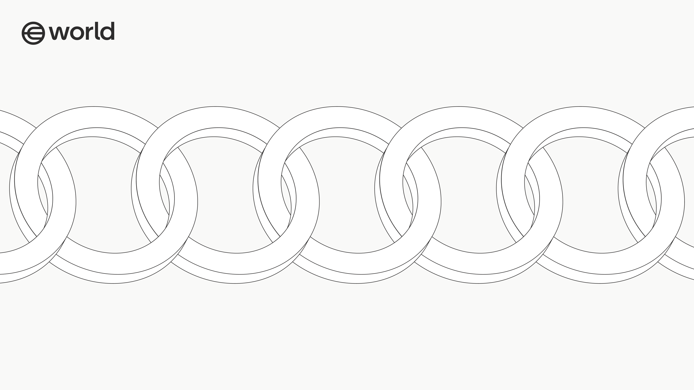

  

<h4 align="center">
    A blockchain designed for humans, built on the <a href="https://stack.optimism.io/">OP Stack</a> and powered by <a href="https://github.com/paradigmxyz/reth"><code>reth</code></a>.
</h4>

  
  
  
  

  <a href="#crates">Crates</a> •
  <a href="#proofs">Proofs</a> •
  <a href="#versioning">Versioning</a> •
  <a href="#development">Development</a> •
  <a href="#specs">Specs</a> •
  <a href="#security">Security</a> •
  <a href="#license">License</a>

## Overview

My Chain is a blockchain designed for humans. It prioritizes scalability and accessibility for real users, providing the rails for a frictionless onchain UX. My Chain is built on the [OP Stack](https://stack.optimism.io/) and powered by [reth](https://github.com/paradigmxyz/reth).

## Crates

| Crate | Description |
|-------|-------------|
| [`my-chain-builder`](./crates/builder) | My Chain Payload Builder components |
| [`my-chain-chainspec`](./crates/chainspec) | My Chain specification and genesis configuration. |
| [`my-chain-cli`](./crates/cli) | My Chain CLI |
| [`my-chain-devnet`](./crates/devnet) | Local devnet setup and tooling. |
| [`my-chain-evm`](./crates/evm) | Custom EVM configuration and execution logic. |
| [`my-chain-node`](./crates/node) | My Chain node components builder |
| [`my-chain-p2p`](./crates/p2p) | RLPX Satellite Protocol Components |
| [`my-chain-payload`](./crates/payload) | Payload job lifecycle management, and continuous block building |
| [`my-chain-pbh`](./crates/pbh) | Priority Blockspace for Humans — verified human transaction prioritization. |
| [`my-chain-pool`](./crates/pool) | Transaction pool with custom ordering. |
| [`my-chain-primitives`](./crates/primitives) | Project wide primitives |
| [`my-chain-rpc`](./crates/rpc) | My Chain RPC API Extensions |
| [`my-chain-validator`](./crates/validator) | My Chain Flashblocks Execution Engine |

## Proofs

| Crate                                                          | Description |
|----------------------------------------------------------------|-------------|
| [`my-chain-prover`](proofs/debug/prover)                    | Shared host-side prover library. |
| [`my-chain-prover-sp1`](proofs/debug/bin/prover-sp1)        | SP1 zkVM prover CLI. |
| [`my-chain-prover-nitro`](proofs/debug/bin/prover-nitro)    | AWS Nitro TEE host prover CLI. |
| [`world-chain-proof-core`](./proofs/measured/core)                      | Shared primitives for SP1 and Nitro TEE fault-proof backends. |
| [`world-chain-proof-nitro-enclave`](./proofs/measured/nitro-enclave)    | AWS Nitro TEE attestation prover for OP Succinct Lite fault proofs. |
| [`my-chain-proof-protocol`](./proofs/protocol)                    | Proof primitives and shared types. |
| [`my-chain-challenger`](proofs/services/challenger)         | Fault-proof challenger service. |
| [`my-chain-proposer`](proofs/services/proposer)             | Output root proposer service. |
| [`my-chain-prover-service`](proofs/services/prover-service) | Proof generation service. |

## Versioning

My Chain's major and minor version numbers are aligned with the underlying reth release line. For a My Chain `X.Y.Z` release, `X.Y` must match reth's `X.Y`. My Chain patch versions are released independently and do not need to match the reth patch version.

## Development

See the [Development Guide](docs/development.md) for building and running My Chain locally.

## Specs

Protocol specifications and design documents are available in the [Specs](specs/overview.md).

## Security

Security issues should be reported privately via [security@toolsforhumanity.com](mailto:security@toolsforhumanity.com). See [`SECURITY.md`](./SECURITY.md) for details.

## License

This project is licensed under the MIT License. See [`LICENSE`](./LICENSE) for details.
